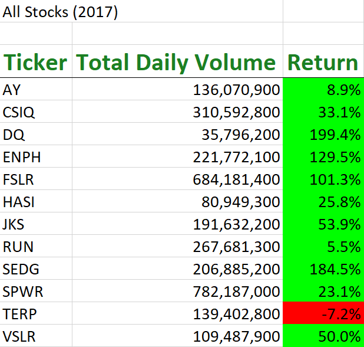
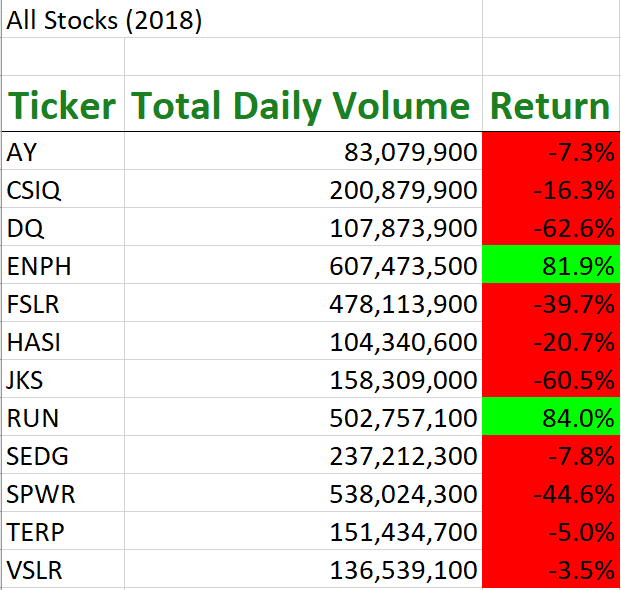
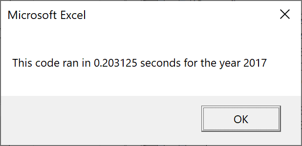
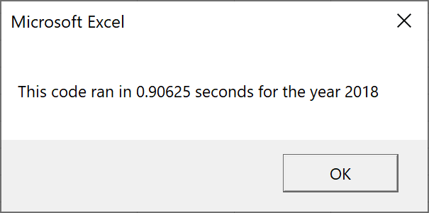

# Stock-Analysis

## Overview of Project

### Purpose

The purpose of this project was to analyze stock performance using data from 12 different stocks in 2 different years. The data contained volume, opening, closing, high, and low prices for every market day of the year for each stock. Using VBA for Excel, macros were created to quickly run analysis for all 12 stocks such as total daily volume and percentage return for the year.

## Results

### Analysis of Stocks

As seen above, stock performance in 2017 was better than stock performance in 2018 almost across the board. Some stocks were traded in greater volumes in 2017 than in 2018 and vice versa. But overall, the percentage returns in 2017 were far greater than the percentage returns in 2018.

### Refactored Code

Original code runtime for 2017:

Refactored code runtime for 2017:

Original code runtime for 2018:

Refactored code runtime for 2018:

## Summary

